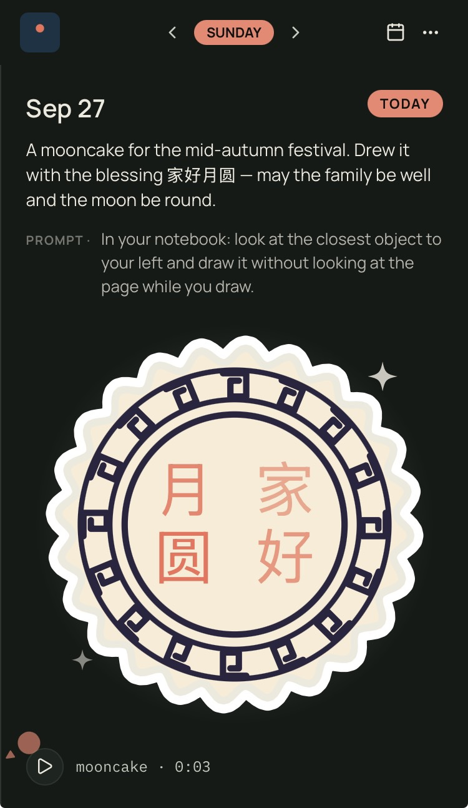
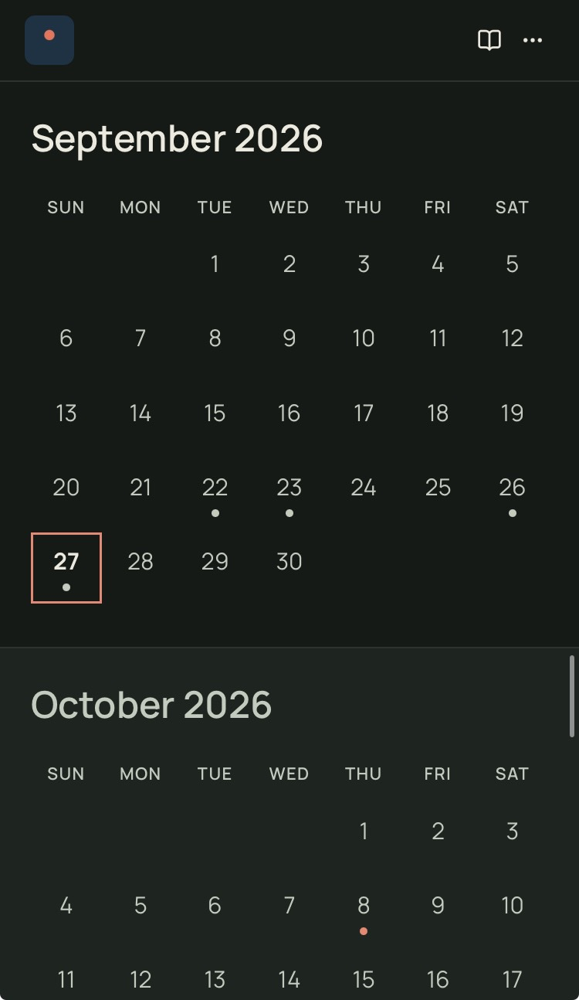

# Starlog

A journal for focus and reflection.

Starlog is the digital companion to a paper journal. You live your day
and talk to your agent; the agent writes everything down; the app
renders it beautifully. The app itself never writes — it only reads from
a database you own.



## A day with Starlog

**Morning.** Your agent sends the day's prompt in chat, around 7am. You
answer however you like — a few typed lines, a photo of the page you
filled in your paper journal, a voice note on your walk. The agent
transcribes it and files it to today's entry. The photo itself is never
kept; only your words.

**Midday.** Something catches your eye — a sketch on a napkin, a tune
in your head, "remind me about the dentist on Thursday." You send it to
the agent. A doodle appears on today's page. A reminder takes its orbit.
A small felt-piano phrase, composed for the moment, waits on the entry.

**Evening.** You open Starlog. The day is there: your words, the
morning's prompt, the doodle, the sound. You tap the sound — the
decoration stirs and dances while the notes play. Nothing to organize,
nothing to sync, nothing to back up. It's just there.

Your data lives in a database you own. Starlog is a nice renderer for
your daily logs.

## Features

**Journal** — Weekday sheets on one continuous scrolling canvas. Each
day holds your entry, the day's prompt, decorations, sounds, and
reminders. Tapping a calendar date or a reminder planet glides you
straight to that day.

**Daily prompts** — A fresh prompt every morning from your agent:
quick one-liners, deeper reflections, maker-flavored nudges,
occasionally something odd. Answer in chat; it lands in the journal.

**Decorations** — Hand-drawn SVG doodles and stickers living on your
days, traced from your own sketches. They can be animated — and an
animated decoration dances when its paired sound plays.

**Sounds** — Sounds are data, the way SVG is data. A score is a small
note list your agent composes; the app's felt-piano synth renders it
the moment you tap play. No audio files, no uploads, no waiting.

**Reminder radar** — Upcoming reminders orbit as planets over the
journal. Tap one to jump to its date.

**Calendar** — A quiet month view, dots on the days you wrote. Tap a
day to visit it.

**Themes** — Light, Dark, and Auto, plus custom themes you design with
your agent. Your journal can look like dusk, paper, or deep space.

**Realtime** — Everything updates live. Tell your agent something in
chat and watch it appear in the app a second later.

**Private by construction** — Your journal lives in your own Supabase
project. The app's keys never leave your device. The agent writes
through narrow, auditable commands — and the app itself can't write at
all.



## Getting started

### With an agent (easiest)

1. Open the app. On the setup screen, find **No project yet?**
2. Copy the one-liner and send it to your AI agent:
   `npx skills add cixzhang/starlog --skill starlog --yes`
3. The agent installs the Starlog skill, provisions your Supabase
   project, applies the schema, and hands you a one-tap setup link.
4. Tap the link — the app configures itself and you're in.

The setup link carries your project's anon key. Treat it like a
password.

### Manually

1. Create a Supabase project.
2. In the SQL editor, apply `spec/migrations/0001_init.sql`, then
   `0002`, `0003`, `0004` in order.
3. Open the app and enter your Project URL and anon key (Supabase
   dashboard → Project Settings → API).

## How-tos

All writing goes through your agent and the `starlog` CLI. The app
stays read-only.

### Adding decorations

Share a drawing or sketch photo in chat. The agent traces it into
Starlog's doodle/sticker style — chunky outlines, a soft halo, a
slight tilt, never more than two colors — and stores it on the day:

```sh
starlog add-decoration --date 2026-09-27 --svg-file mooncake.svg \
  --kind sticker --meta '{"label":"mooncake"}'
```

Animated SVGs (SMIL) loop gently on the page, and a paired sound can
drive them.

### Adding sounds

Ask for one — "make a sound for the mooncake" — or share audio in
chat. The agent composes in the felt-piano voice (`sound-synth`
skill), plays you a preview, and stores the score once you approve:

```sh
starlog add-score --date 2026-09-27 --title "mooncake" \
  --notes '[{"n":48,"t":0,"d":2.2,"v":0.42},...]' \
  --decoration-id 83326ac7-…
```

A score is just data: `n` the MIDI note, `t` the start in seconds, `d`
the duration, `v` the velocity. The app synthesizes it on tap, and
`--decoration-id` syncs it with an animated decoration.

Hums and melodies can be transcribed the same way — the agent turns a
recording into notes and re-voices it in felt piano.

### Adding reminders

Just say it: "remind me about the UIE Summit on Oct 8 at 9am."

```sh
starlog add-reminder --title "UIE Summit" --at "2026-10-08T09:00:00-07:00"
```

The reminder lands on its day and takes its orbit on the radar.

### Custom themes

"Make me a custom Starlog theme." A theme is JSON — color tokens,
paper-and-ink tokens, fonts. The agent drafts it, previews it with
you, and saves it. Switch anytime in Settings → Theme.

## What's here

- `spec/` — the data contract: schema migrations, row-level security,
  the Markdown subset entries support. Everything the app does must be
  provable against this contract.
- `pwa/` — the read-only PWA (Astryx + Vite, deployed to Vercel).
- `skills/` — agent skills, installable via
  `npx skills add cixzhang/starlog --skill <name>`:
  `starlog` (the writer CLI) and `sound-synth` (felt-piano cue renderer).
  The CLI is also downloadable at
  `https://starlog-journal.vercel.app/cli/starlog`.
- `docs/screenshots/` — screenshots for this README.

## Status

Schema v0.6.0 · PWA live. Built with an AI agent, in conversation —
this README included.
